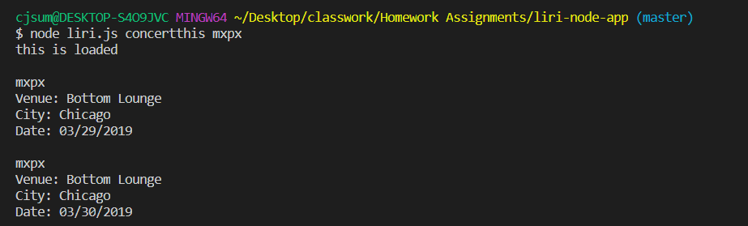
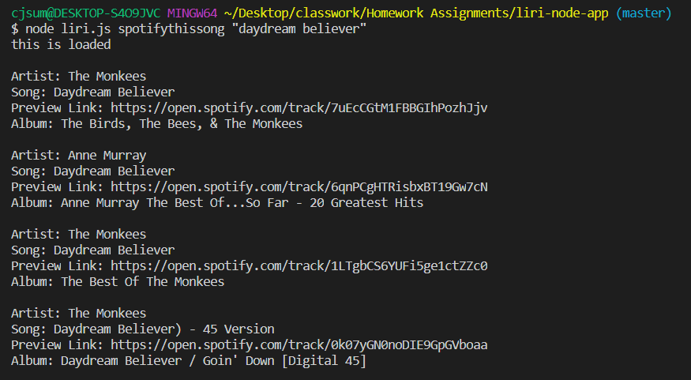
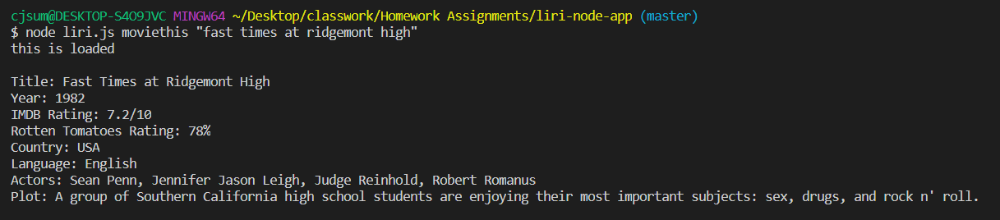
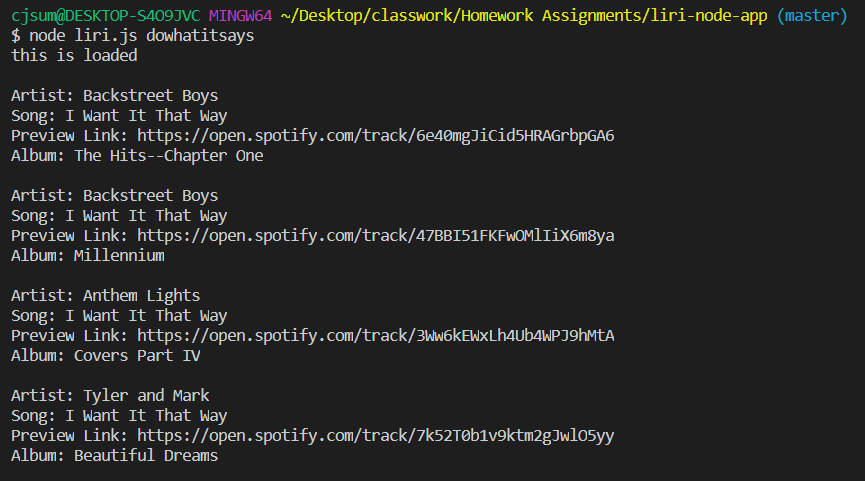

# liri bot

Liri is a command line application that takes user commands and queries from the command line and returns data from API's. The following commands have been hard coded into the program to give the user the capability to look up songs, concerts and movie information:
 
<strong>concertThis</strong> - Uses the bandsintown API to takes a band's name form the user and returns that bands upcoming concert.
 
<strong>spotifyThis</strong> - Uses the spotify API to take a song title from the user and return the artist, song name, spotify link and album.
 
<strong>movieThis</strong> - Uses the OMDB API to take in a movie title and return the title, cast, release year, IMDB and Rotten Apple rating, country, language and plot.
 

<h2><strong>How to Use</strong></h2>
Before you get started, make sure you have these node packages installed:

<strong>Dotenv:</strong> Dotenv is a zero-dependency module that loads environment variables from a .env file into process.env. Storing configuration in the environment separate from code is based on The Twelve-Factor App methodology.
 
Command Line: 'npm install dotenv'
 
<strong>Request:</strong> - Request is designed to be the simplest way possible to make http calls. It supports HTTPS and follows redirects by default.
 
Command Line: 'npm install request'
 
<strong>Moment:</strong> - A lightweight JavaScript date library for parsing, validating, manipulating, and formatting dates.
 
Command Line: 'npm install moment'
 
<strong>Fs:</strong> - a built in node package
 
(npm i request)
 
Read more about these methods <a href="http://www.npmjs.com">here</a>

<h2><strong>Functionality</strong></h2>
* Bands In Town 
* To run this API simply type the following in the terminal node liri.js concertthis (place band name here)

 
 
* Spotify
* To run this API simply the following in the terminal node liri.js spotifythissong (place song title here)

 
 
* OMDB
* To run this API simply type the following in the terminal node liri.js  moviethis (place movie title here)

 
 
* Do What It Says 
* To run this simply type the following in the terminal node liri.js dowhatitsays
* This will grab the information from the random.txt file and use the Spotify API and display the following info:

 
 

<h2><strong>Technology</strong></h2>
    * NodeJS 
    * OMDB API 
    * Spotify API 
    * Bandsintown API

<h2><strong>Author</strong></h2>
* CJ Summers
